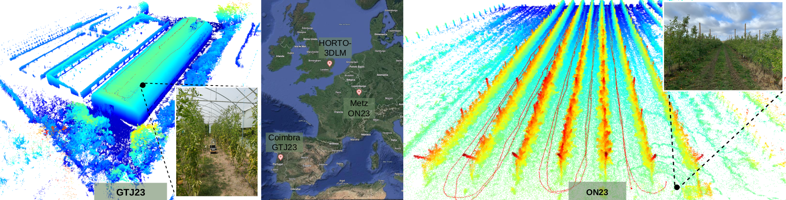
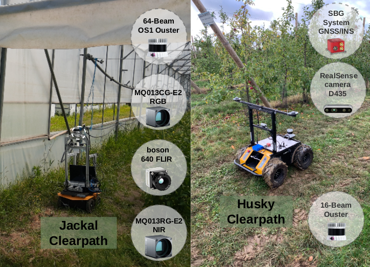
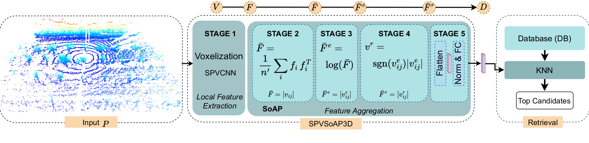
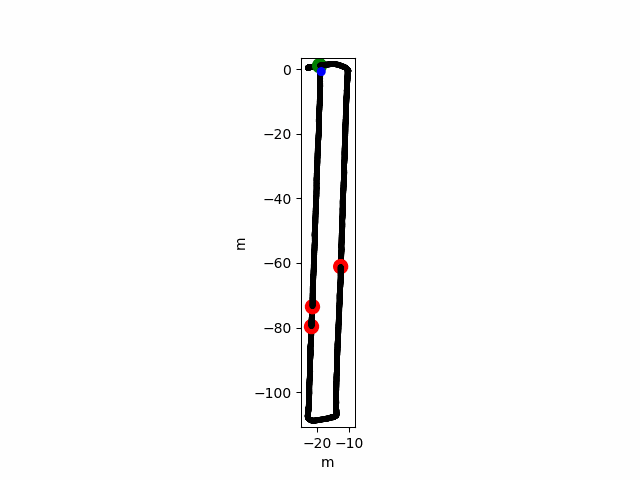

<table>
  <tr>
    <td align="center"> 
    <td align="center"> 
  </tr>
</table>


### Pipeline
<table>
  <tr>
<td align="center"> 
  </tr>
</table>

## INSTALLATION

#### Set up environment
- python 3.9.4
- Cuda 11.7
- pytorch 2.0.1
- open3d
- torchpack

#### Create conda environment with python:
```
conda create -n pr_env python=3.9.4
```
```
conda activate pr_env
```
#### Install Conda 11.7.0
```
conda install -c "nvidia/label/cuda-11.7.0" cuda-toolkit
```
#### Install Pytorch 2.0.1

```
conda install pytorch==2.0.1 torchvision==0.15.2 torchaudio==2.0.2 pytorch-cuda=11.7 -c pytorch -c nvidia
```
#### Install Sparse
```
pip install --upgrade git+https://github.com/mit-han-lab/torchsparse.git@v1.4.0
```

#### Install remaining libs
```
pip install -r requirements.txt
```


## Download 

### Dataset

Download the dataset from https://github.com/Cybonic/HORTO-3DLM


### Checkpoints 
The checkpoints can be downloaded from  [SPVSoAP3D_iros24.zip](https://nas-greenbotics.isr.uc.pt/drive/d/s/xkN8AYuu7uiP9n4kp2Am1fUNFxE2dLaa/bRgEMDjkuiBPCYZb9qKxFg7_3cZ50SXd-DLkgwc17OQs).

SPVSoAP3D_iros24.zip contains additionally the descriptors and results obtained with SPVSoAP3D on all sequences. SPVSoAP3D_iros24.zip has the following strucutre:
```
24SPVSoAP3D_iros24.zip
├── READ-ME.md # file explaining the meaning of each file 
├── GT23 
├── OJ22
├── OJ23
├── ON22
├── ON23
└── SJ23
    ├── checkpoints.pth # trained weights
    ├── descriptors.torch # descriptors
    └── place
        ├── results_precision.csv # precision 
        ├── results_recall.csv # recall 
        ├── loops.csv # predicted loops
        ├── scores.csv # similarity scores  
        └── target.csv # ground-truth loops

```
For more details on the xxx.csv files, please read READ-ME.md file in the 24SPVSoAP3D_iros24.zip.

## Testing


### Run eval on all sequnces

**1**. Edite the *script_eval.py* file, adding the chackpoint and dataset paths

script_eval.py:
```
chkpt_root = 'path/to/checkpoints'

dataset_root = 'path/to/dataset'

# Select the option to run from checkpoints.pth or precomputed descriptors.torch 
resume  = "checkpoints.pth" # <-- choise [checkpoints.pth, descriptors.torch]
```

**2**. Run the file
```
python script_eval.py
```

### Run eval on a single sequence 

resume choice: [checkpoints.pth or descriptors.torch]

```
python eval_knn.py 
    --val_set <seq>
    --resume <path/to/24SPVSoAP3D_iros24>/<seq>/<resume> 
    --save_predictions  <path/to/save/predictions>
```
**Note:** We have noticed that performance changes when using GPU with different cuda versions.  

## Training

Training Triplets
<table>
  <tr>
    <td  align="center">  </td>
    <td align="center">  </td>
  </tr>
  <tr>
    <td align="center"> ON23 </td>
    <td align="center"> GTJ23 </td>
  </tr>
</table>


### Script to train all sequences

**1.** First edit ***script_train.py***  to set the path to the dataset and other parameters   

**2.** Then, run script
```
python script_train.py 
```


### Train on a single sequence
```
python train_knn.py 
    --val_set <seq>
    --network <model>
    --resume <chkpt_root>/<model>/<seq>/<resume>
    --memory <memory>  # [DISK, RAM] 
    --device cuda' # [cuda,cpu]
    --save_predictions  <path/to/save/predictions> # Save predictions
    -e <experiment name>
    --roi 0 # point cloud cropping range [m] around the LiDAR origin 
    --augmentation 0  # [0,1] 
    --pcl_norm 0 # chcoice [0,1] Normalization of the point clouds so points are within [0,1]
```
